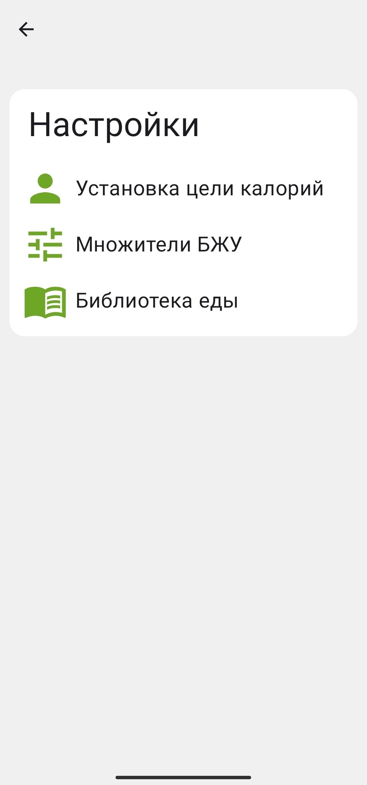
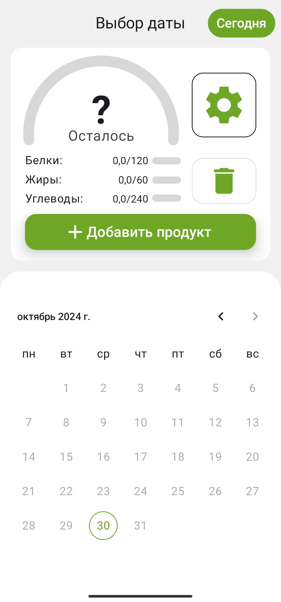

📱 Мобильный разработчик 

Технологии: Kotlin, Android, Jetpack Compose

Изученные языки: C++, Python, Java, C#, Kotlin, HTML, CSS, JavaScript

# Проекты

### Дневник питания

Android приложение на Kotlin. Технологии: Jetpack Compose, Room, Hilt, Material 3

  
  
  
  
  
  
  
  
  

### Pomodoro Таймер

Kotlin Multiplatform приложение. Технологии: Compose Multiplatform, Koin, Material 3

### Проекты курса фронтенд вуза РТУ МИРЭА совместно с Яндекс.Практикум

- https://github.com/3lcode/frontend-project-1

- https://github.com/3lcode/frontend-project-2

- https://github.com/3lcode/frontend-project-3

- https://github.com/3lcode/frontend-project-4

- https://github.com/3lcode/frontend-project-5

- https://github.com/3lcode/frontend-project-6
